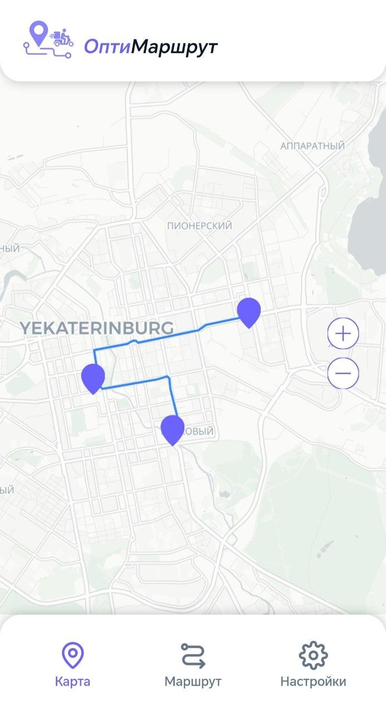
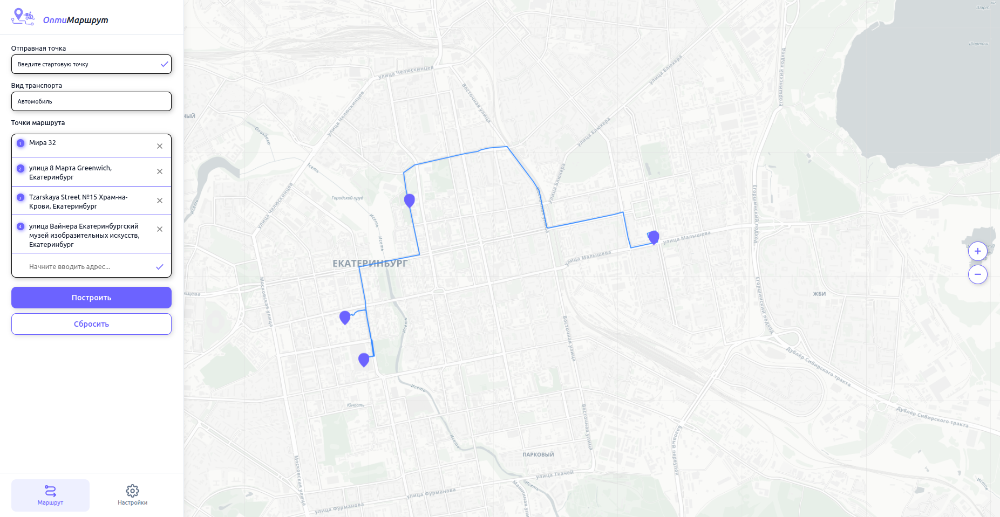

# 🚀 Optimization Urban Delivery Routes

Интеллектуальная система оптимизации логистики, разработанная для малого бизнеса и самозанятых. Проект позволяет минимизировать время и расходы на доставку, находя оптимальные пути объезда нескольких точек на карте.

## 🌟 Основные возможности
* **Умная оптимизация:** Использование алгоритмов Simulated Annealing и 2-opt для эффективного решения задачи коммивояжера.
* **Интерактивная карта:** Визуализация маршрутов на базе Leaflet с отображением всех точек доставки.
* **История и избранное:** Сохранение часто используемых маршрутов для быстрого доступа.
* **Локальная навигация:** Использование собственного поднятого инстанса OSRM для работы с дорожными данными.

---

## 📸 Интерфейс
| **Главный экран** | **Построение маршрута** | **История заказов** |
| :--- | :--- | :--- |
|  |  |  |
| **History**  | **Favorite** | **Generation** |
|  |  |  |



---

## 🛠 Технологический стек
* **Frontend:** React + Vite, Leaflet.
* **Backend:** FastAPI, OSRM (Open Source Routing Machine).
* **Infrastructure:** Docker, Docker Compose.

---

## ⚙️ Установка и запуск

### Предварительные требования
* Установленный Docker и Docker Compose.
* Node.js (для разработки фронтенда).

### Бэкенд (Docker)
Запуск инфраструктуры и бэкенда:
```bash
docker-compose up -d

```

### Фронтенд (Development)

Установка зависимостей и запуск в режиме разработки:

```bash
cd frontend
npm install
npm run dev

```

---

## 👥 Команда проекта

Над проектом работали:

* **Argon573** (Тимлид, Frontend-разработчик): Архитектура интерфейса, интеграция карты Leaflet, общее руководство проектом.
* **Qushl** (Backend-разработчик): Реализация алгоритмов оптимизации маршрута, проектирование API на FastAPI.
* **vlad131206zap-beep** (DevOps): Настройка Docker-контейнеров, развертывание локального OSRM и CI/CD процессов.

---

*Проект предназначен для оптимизации городских доставок.*
